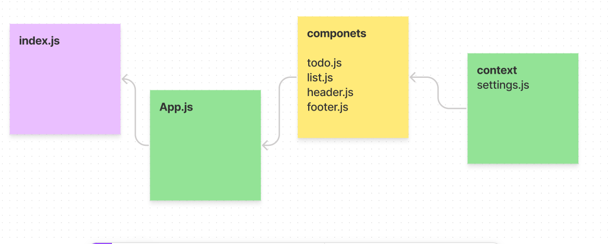

# todo-app

---

## LAB 31 - Context API
## LAB 32 - Context API - Behaviors
## LAB 33 - `<Login />` and `<Auth />`
## LAB 34 - `<Login />` and `<Auth />`

- me and osama we help each other to solve this lab (31,32,33) 
- our group (sultan , hasan , ahmad ,yazan ) for lab (34)

## PR link :

- [PR1](https://github.com/abu-nofal/todo-app/pull/2)
- [PR2](https://github.com/abu-nofal/todo-app/pull/4)
- [PR3](https://github.com/abu-nofal/todo-app/pull/6)
- [PR4](https://github.com/abu-nofal/todo-app/pull/8)

## Deployed link :

- [sandBox-1](https://m0zgc.csb.app/)
- [sandBox-2](https://hl90x.csb.app/)
- [sandBox-3](https://8it9i.csb.app/)
- [sandBox-4](https://fvies.csb.app/)

## UML :

- 

